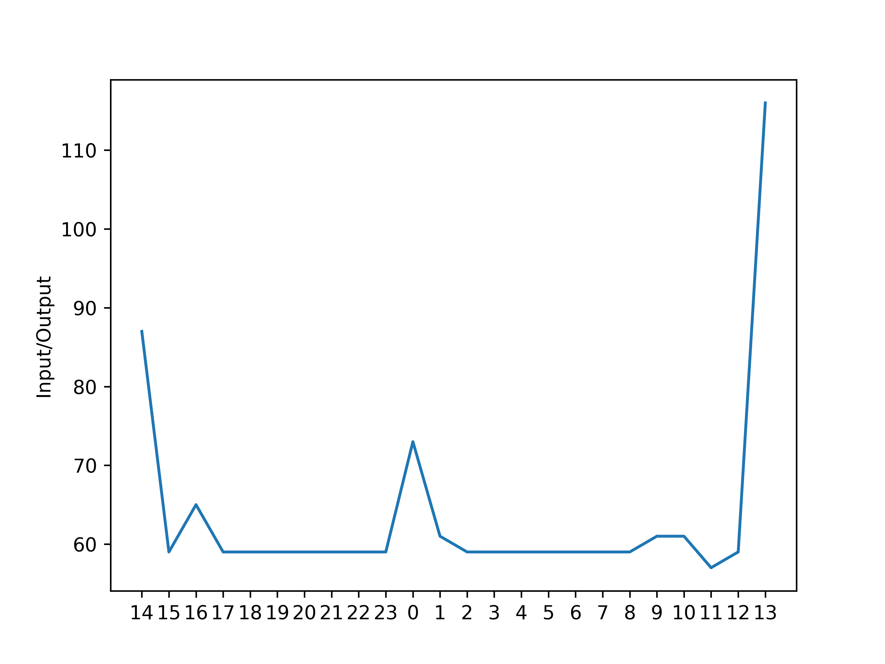

# wat - A simple & very useful watt-meter for Corsair Link supported devices!

This code helps you monitor your power consumptions, easy as pie!

## Requirements

- A Corsair Link supported Power Supply Unit, connected via the appropriate USB cable
- `liquidctl` installed on your computer
- `python3` installed on your computer
- `mariadb` installed and configured
- python's libraries, that can be found on the `requirements.txt` file

## Usage

I do it via a cron command like the following:

```cron
* * * * * python /srv/services/wat/main.py
```

After some time, check results with the `show.py` script!

```bash
python /srv/services/wat/show.py
```

Output:


### License

WTFPL License, see `LICENSE` file for more information.